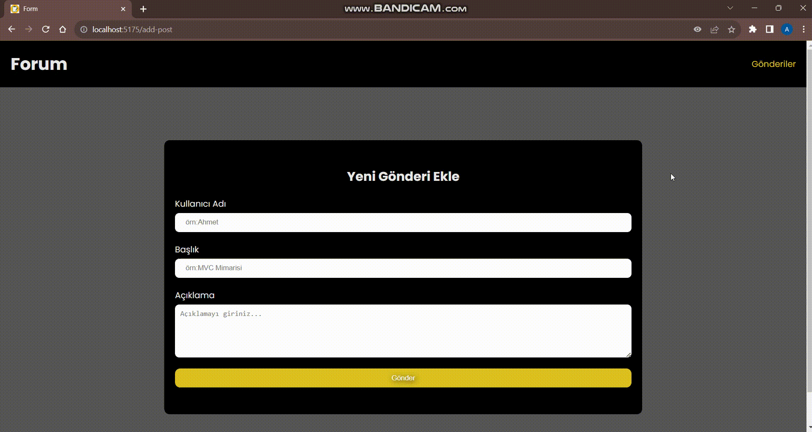

# MVC-Based Form Page Project

# USED TECHNOLOGIES
- React Vite
- MVC (Model View Controller)
- SCSS
- DESCRIPTION:
This project is a web form page developed using the Model-View-Controller (MVC) design pattern. The MVC design pattern allows us to structure the application by separating the data logic (Model), user interface (View), and the interaction between these two components (Controller).

# MVC (Model View Controller) Design Pattern
Model: Represents the data logic of the application.

For example, object values for a form that we intend to capture in the project.
View: Represents the user interface.

For example, JSX code is written here for elements like divs and form headers.
Controller: Facilitates communication between the Model and View.

For example, it holds functions that respond to user interactions and manage API requests.
- Libraries
npm install
- - axios
- - react-router-dom
- -json-server
- -sass

# Roadmap:
- Fetch API blog data (Controller).

- Render cards for each blog entry (View).
Create a form (View).

- Store input changes in state.
- Define the values that the state will hold (Model).
- Submit the form and send the data to the API, then redirect the user (Controller).

